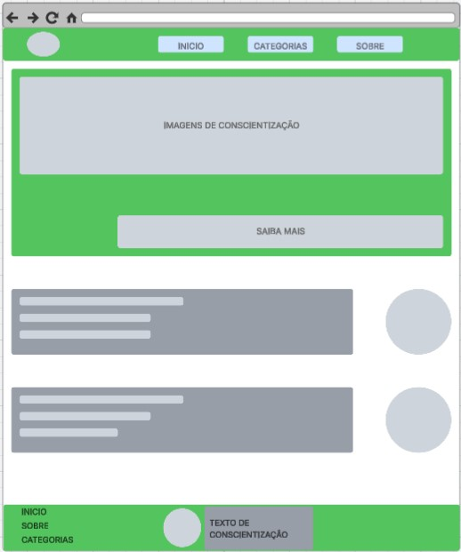

# 🌱 Life Hub  

## 👥 Membros do grupo
- Enzo Basani  
- Gabriel Gomes  
- Vinicius Pini  
- Pedro Bosso  

---

## 📌 Tema do Projeto
**Guia de Descarte Correto e Pontos Sustentáveis**

---

## 📝 Descrição
Muitas pessoas têm dúvidas sobre como descartar corretamente os diferentes tipos de resíduos, o que contribui para o descarte incorreto e o aumento da poluição.  
Pensando nisso, o **Life Hub** foi criado como um **site estático**, que oferece um guia **visual, simples e organizado** para orientar o descarte adequado de resíduos.  

Nosso objetivo é **educar e conscientizar** a população, tornando o processo de descarte mais acessível e sustentável, além de indicar **pontos de coleta e descarte**.  

---

## 🚀 Funcionalidades
- Guia visual de descarte por tipo de resíduo.  
- Dicas rápidas sobre reciclagem e reutilização.  
- Lista de pontos de coleta e locais sustentáveis.  

---

## 🛠️ Tecnologias Utilizadas
- **HTML5**  
- **CSS3**  

---

## 🎯 Objetivo
Promover a conscientização ambiental e reduzir o impacto da poluição através de um acesso fácil a informações sobre descarte correto.  

---

## 📷 Prévia do Projeto

---

## 📌 Como acessar
> Em breve disponibilizaremos o link do projeto hospedado.  

---

## 📄 Licença
Este projeto é de uso educacional e sem fins lucrativos.  

---
🌍 **Life Hub - Pequenas ações, grandes mudanças.**
